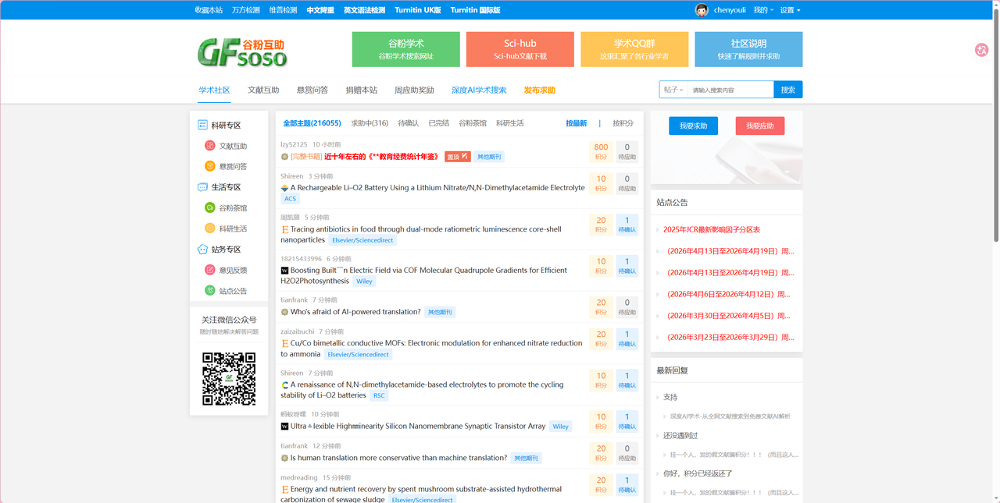
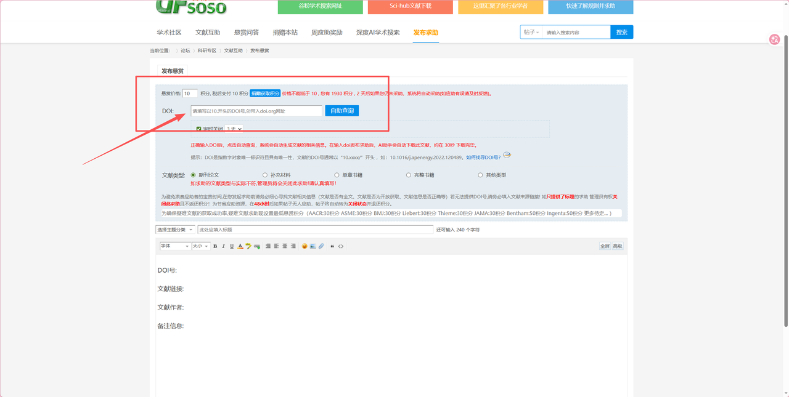
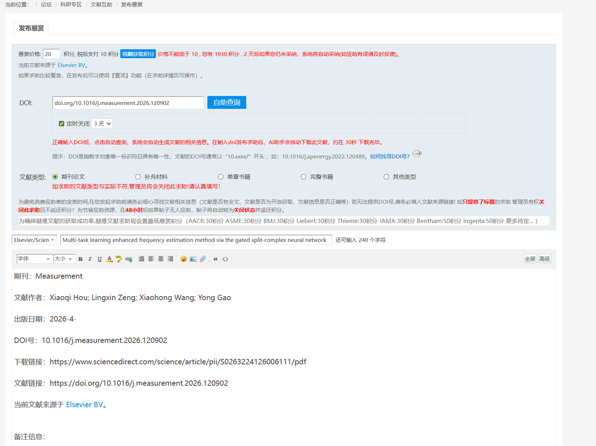
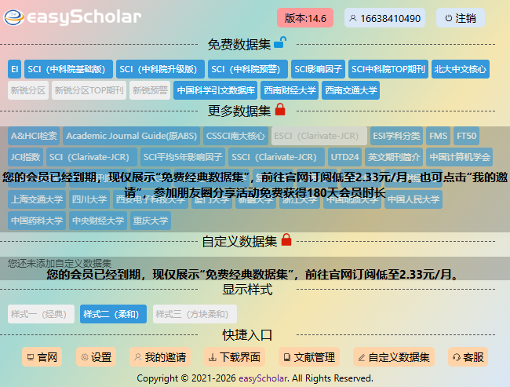
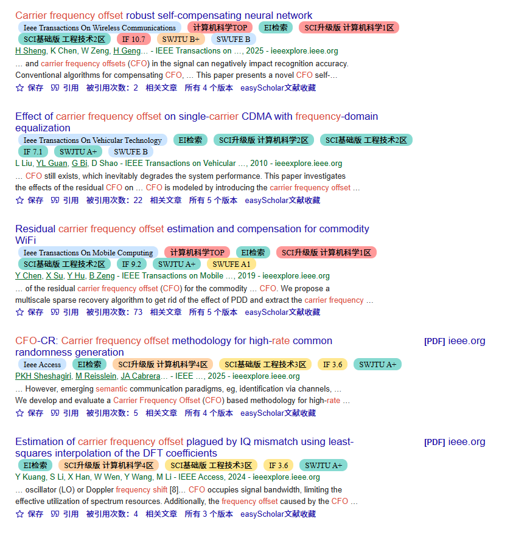

上个月导师让分享一些常用的工具给组内新加入的同学，于是写了这篇文档，近期上传到博客之上。

# 文献管理以及查找

## 文献检索

google scholar 、 IEEE 、x-mol、学校可以直接下IEEE的刊，如果有什么刊学校没法下载需要订阅 参考下面方法

url： https://bbs.91bdqu.com/

点击求助  将DIO 号粘贴进去即可 &#x20;

如下载爱斯维尔期刊   [doi.org/10.1016/j.measurement.2026.120902](https://doi.org/10.1016/j.measurement.2026.120902)

## 文献管理

浏览器 可以寻找插件 EasyScholar  如图

插件添加后，在浏览论文时会显示分区细节 如下图

### &#x20;阅读器分享(方便文献管理)

Zotero  （与坚果云可实现多端同步）   B站有教程 自己检索&#x20;

小绿鲸

### 文献笔记记录

OneNote    &#x20;

也可以学习使用 markdown  进行笔记编写    (Typora 有破解教程)

## 绘图工具

Visio （微软）  画出来的图更细节、上手较难

Drwa.io  （有网页版 和 桌面版） 操作简单

# 论文撰写软件

Latex （Texstudio） 需要下载，没有编译时长限制

Overleaf （在线软件） 不需要下载，比较方便，可以共享，有编译时长

# 建议学习的"基本功"

git相关知识的学习（做好代码管理）     参考 https://www.bilibili.com/video/BV1Hkr7YYEh8/?spm\_id\_from=333.337.search-card.all.click\&vd\_source=509c734c79feb149af97a81bb0c6b923

https://www.bilibili.com/video/BV1Fw4m1C7Tq/?spm\_id\_from=333.337.search-card.all.click\&vd\_source=509c734c79feb149af97a81bb0c6b923

https://www.bilibili.com/video/BV1G8CFYvEjt/?spm\_id\_from=333.337.search-card.all.click\&vd\_source=509c734c79feb149af97a81bb0c6b923

远程ssh （连接服务器）

配置conda环境 、pytorch相关知识   （B站有对应教程，熟悉即可）

#
